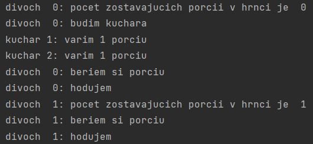
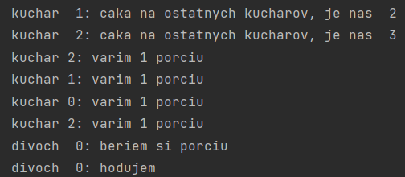

# Smokers and Savages
This branch is used for fifth week assignments where I am working
on ```Smokers``` and ```Savages``` tasks.

# Smokers
This task is in ```smokers.py``` file. It represents **smokers** 
making their cigarettes and waiting for resources to be able to
make them. The **agents** are providing the resources and **pushers**
are managing delivered resources either on the table or to the smokers.

There is a **prioritization** problem. If there are many resources
available, the smokers eventually don't have to wait. But there
is an ```if - elif - else``` which involuntarily forces to
give priority to the first ```if``` statement. I decided to
solve this by adding another ```if``` at the beginning. Firstly
I will find out if there are both resources available, e.g. paper
and tobacco and if so, I will generate random number from **0-1**
interval which decides which of the resource will be passed.

# Savages
This solution is in ```savages.py``` file. My assignment was
to edit existing solution by creating possibility to add more
cooks. I've tried a few solutions. Firstly, I needed to create
multiple threads representing multiple cooks. Then I wanted them
to cook separately, so I added loop in range of total required
servings. Every loop added **1** serving into the pot. I added
one more barrier for cooks, because I wanted them to start cooking
at the same time. By output ```print``` I could see that they all
arrived at the barrier but only the last one arrived did the cooking.
I tried to add **turnstile** to the cooking process, but it didn't help.
Possible reason that came up to my mind is once again fifo front problem.
But there can be problem with barrier as well, because I could observe
that once the pot needed to be cooked again, the previous waiting cook
did the cooking. This might mean that they are waiting in front.
But what confuses me is that the barrier is outside the function call
(```line 218```) so all the threads should be released at once and
all of them should go into the function call on the line ```222```.
\
\
After approximately 20th "mind" executing the code I found out,
that I was passing the ```empty_pot()``` signal without the value.
So I edited it to```signal(number_of_cooks)``` and It solved my problem
I was describing above. Then I created ```Shared``` class method
```add_serving()```, where I'm incrementing servings one by one
and checking whether the pot is full or not. The thread which fills
the last serving into the pot then call ```signal()``` for the
```full_pot()``` so the savages can start eating. I've tested the solution
for both situations. First one is where the servings>cooks and
cooks>servings as well. The example outputs are shown under the
pseudocode.

## Pseudocode of edited functions
```
M - number of food portions which fits into the pot
N - number of savages
C - number of cooks

class Shared():
    ...
    ...
    def add_serving(self):
        self.mutex_cooks.lock()
        self.servings += 1
        if self.servings == M:
            self.full_pot.signal()
        self.mutex_cooks.unlock()
    ...
    ...
    
def savage(savage_id, shared):
    while True:
        ...
        ...
        if shared.servings == 0:
            print(output)
            shared.empty_pot.signal(C)
            shared.full_pot.wait()
        ...
        ...

    
def put_servings_in_pot(m, cook_id, shared):
     while True:
        shared.add_serving()
        print(output)
        # cooking the meal
        sleep(some time for simulation)
    

def cook(m, cook_id, shared):
    shared.cook_barrier.wait()
    while True:
        shared.empty_pot.wait()
        put_servings_in_pot(m, cook_id, shared)
        shared.full_pot.signal()
```

# Example outputs of running program
Number of cooks(3) is higher than number of servings(2).



Number of servings(4) is higher than number of cooks(3).



**License: MIT\
Author: Matúš Kanda\
School: Slovak University of Technology in Bratislava (STU)**

