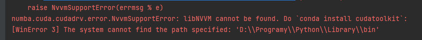
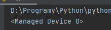

# CUDA
This branch is used for ninth week assignments where I'm working with CUDA.

I was getting an error showed down below

even tho my cuda should be working properly because the code:
```
from numba import cuda
print(cuda.gpus)
```
gave me this result:



and the Path is set as well


So I was rly trying to find some solution but there was not many helpful articles
on the Internet. \
So I'm sorry to say this but...


**License: MIT\
Author: Matúš Kanda\
School: Slovak University of Technology in Bratislava (STU)**

