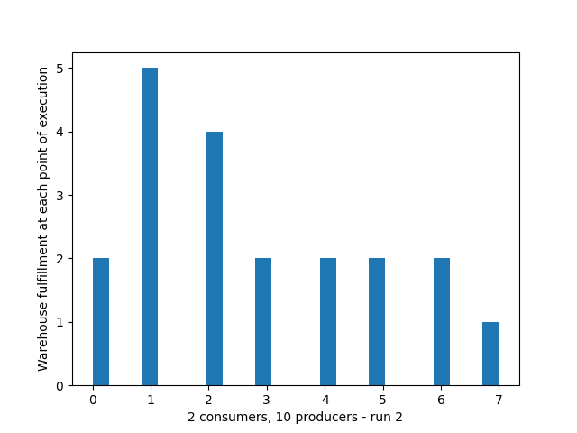
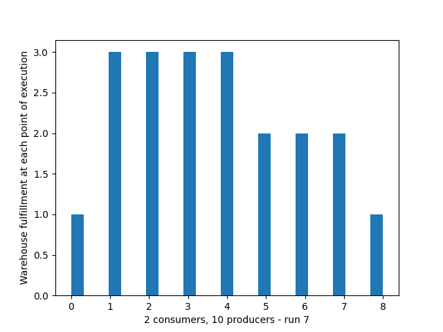
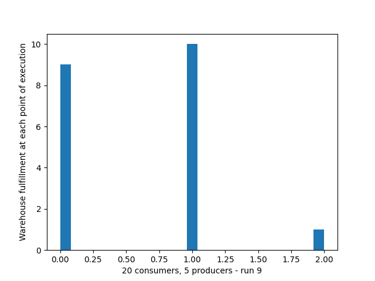
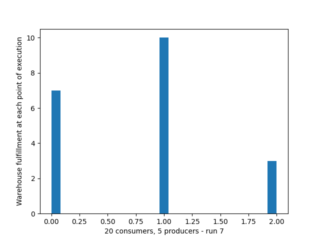
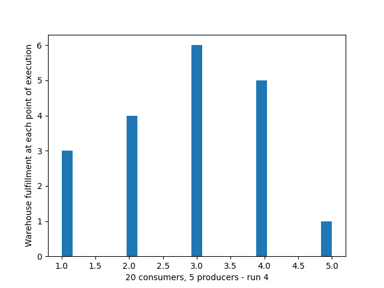

# ADT Lightswitch
This branch is used for third week assignments where 
I am working with ADT Lightswitch, Producer-Consumer and 
Reader-Writer solutions.

## LightSwitch
This solution is in ```lightswitch.py``` file.
It is simulating writer and reader of the same file. The writer or 
reader has to wait for release the "room". The first thread that enters
the room has to lock it for either readers or writer (depends on
which one entered the room). The last thread will then release the 
lock and let other threads (writer or reade) to go in and do the same
again. To run this code correctly we should use ```fifo``` type of
front so even the "oppressed" parts of code can get into to execution.

## Producer/Consumer
This solution is in ```producer_consumer.py``` file.
It's kind of similar like previous task, but this time 
we are simulating consumers consuming something and producers
taking it from the warehouse. We were creating some "experiments"
to observer it's behaviour.\
\
For example the image below is an example (one of many images) of 
10 runs of the case where consumer threads are created before 
producer's threads. We had**2** consumers and **10** producers. 
We saw that the warehouse fulfillment has never reached **0** and
the maximum value reached **5**



In another try we switched the position of consumer's and producer's 
threads initialization. TWe could observer that it didn't have
impact on the numbers itself, but the warehouse was evenly filled for
almost the whole time.



Now we can try to switch the number of producers and consumers.
For example we can make only 5 producers and 20 consumers. Producers
are created first and consumers after that. We can observe that the
consumer's threads had to wait for producers to produce the items. We
can see big wholes in our graph, because consumers were waiting and then
took everything from the warehouse.



Let's switch the order of initialization and watch if anything changes
We can say that id didn't have any significant impact of the result 
compared to the previous one.



What about change of the execution time of producing/consuming?
Let's prolong the production time. Now the production and consumption
have the same time of execution. We are again using 20 consumers
and 5 producers. We can see there are still holes in our graph, but
the values are significantly more even than in previous one.




**License: MIT\
Author: Matúš Kanda\
School: Slovak University of Technology in Bratislava (STU)**

